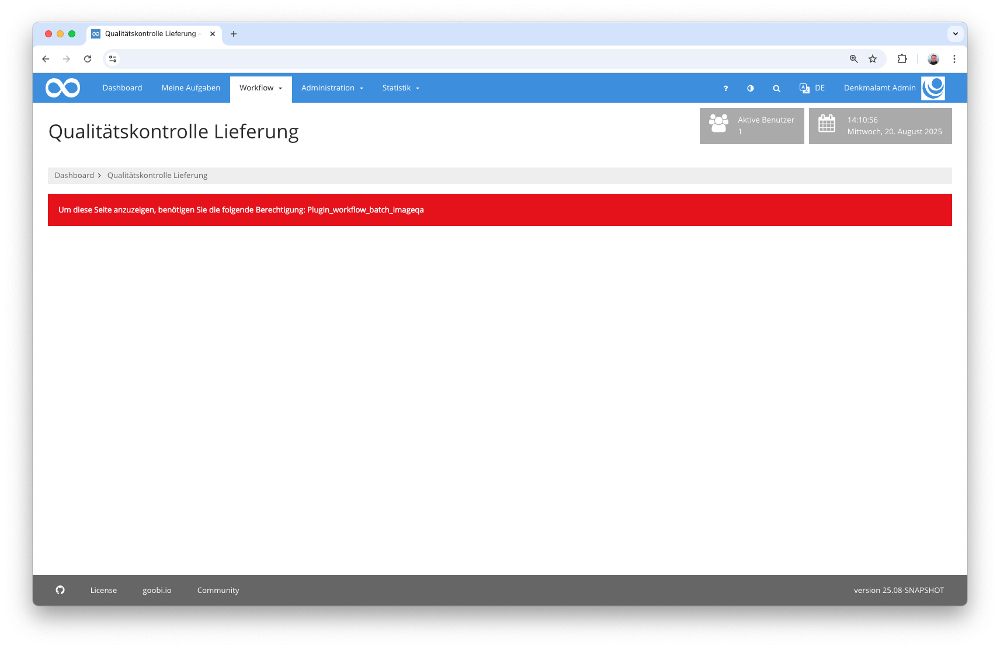
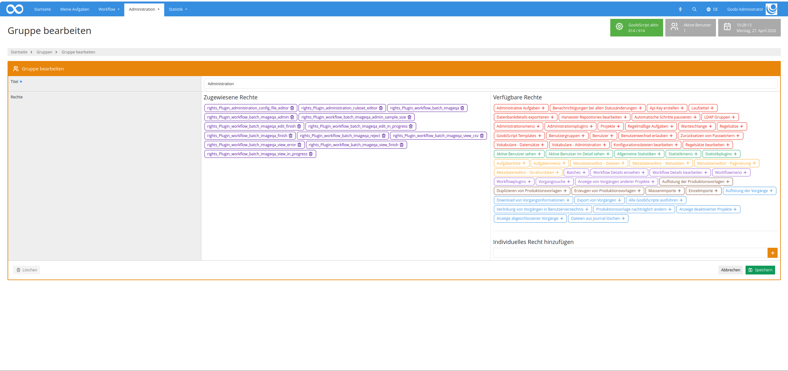
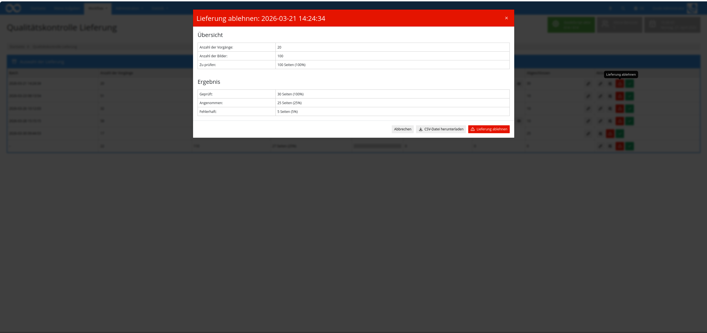
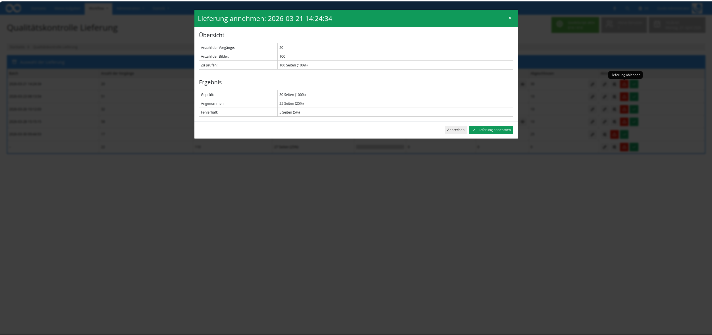

## Einführung
Dieses Workflow-Plugin erlaubt die Durchführung einer prozentualen Qualitätskontrolle von Lieferungen. Dabei können die Digitalisate und Metadaten vieler Vorgänge gleichzeitig begutachtet werden.

## Installation
Um das Plugin nutzen zu können, müssen folgende Dateien installiert werden:

```bash
/opt/digiverso/goobi/plugins/workflow/plugin-workflow-batch-imageqa-base.jar
/opt/digiverso/goobi/plugins/GUI/plugin-workflow-batch-imageqa-gui.jar
/opt/digiverso/goobi/config/plugin_intranda_workflow_batch_imageqa.xml
```

Für eine Nutzung dieses Plugins muss der Nutzer über die korrekte Rollenberechtigung verfügen.



Bitte weisen Sie daher der Gruppe die Rolle `Plugin_workflow_batch_imageqa` zu.




## Überblick und Funktionsweise
Wenn das Plugin korrekt installiert und konfiguriert wurde, ist es innerhalb des Menüpunkts `Workflow` zu finden.


Auf der Übersichtsseite werden alle Lieferungen (z.B. eines Scandienstleisters) angezeigt, die auf eine Abnahme warten. Hierfür werden all diejenigen Vorgänge aller Batches geprüft, bei denen der konfigurierte Arbeitsschritt (z.B. `Qualitätskontrolle`) gerade offen ist. Wenn nicht alle Vorgänge eines Batches genau diesen Status haben, wird der Batch als Lieferung hier noch nicht angezeigt.

Öffnet man einen solchen Batch als Lieferung, wird anhand der konfigurierten Prozentangabe ermittelt, wie viele und welche Bilder angezeigt werden sollen. Dabei werden so viele Vorgänge vollständig angezeigt, bis die Anzahl der erwarteten Bilder erreicht bzw. überschritten wurde. 


Auf die Auswahl der Vorgänge hat der Nutzer keinen Einfluss. Diese erfolgt randomisiert. Es gibt allerdings zwei Ausnahmen von Vorgängen, die definitiv innerhalb der anzuzeigenden Vorgänge aufgeführt werden:

- alle Vorgänge eines Batches, die zuvor eine Fehlerschleife durchlaufen haben 
- alle Vorgänge eines Batches, bei denen bestimmte, konfigurierbare Metadaten existieren und Inhalte aufweisen 

Welche Metadaten neben der Bilder angezeigt werden, ist für jeden anzuzeigenden Vorgang definierbar innerhalb der Konfiguration. Der prozentuale Wert kann außerdem im oberen rechten Bereich des Plugins neu gesetzt werden. Außerdem kann für jeden dargestellten Vorgang der Metadateneditor betreten werden, um dort Änderungen an den Daten vorzunehmen.

Wenn ein Vorgang fehlerhaft ist, kann dafür eine Fehlermeldung verfasst werden.


Sämtliche Fehlermeldungen werden im unteren Bereich des Plugins aufgeführt und erlauben, die Abnahme einer solchen Lieferung abzulehnen. Darüber hinaus ist es außerdem auch möglich, eine CSV-Datei mit allen Fehlermeldungen herunterzuladen.



Bei Fehlern kann die Lieferung abgelehnt werden. Als fehlerhaft markierte Vorgänge werden in diesem Fall an den konfigurierten Arbeitschritt des Workflows zurückgeschickt. 

Wird eine Lieferung für gut befunden, kann diese akzeptiert werden. Alle Vorgänge der Lieferung werden dann den aktuellen Arbeitsschritt abschließen und im Workflow weiter voranschreiten.




## Konfiguration
Die Konfiguration des Plugins erfolgt in der Datei `plugin_intranda_workflow_batch_imageqa.xml` wie hier aufgezeigt:

{{CONFIG_CONTENT}}

Die folgende Tabelle enthält eine Zusammenstellung der Parameter und ihrer Beschreibungen:

Parameter                  | Erläuterung
---------------------------|----------------------------------------------------------------------------------------------------------------------------------------------------------------------------------------------------------------------
`qaTaskName`               | Alle Vorgänge in einem Batch müssen sich gerasde in diesem Arbeitsschritt befinden (offen sein), damit sie in der Auflistung berücksichtigt werden.
`errorStepName`            | Dieser Schritt wird geöffnet, wenn Vorgänge als fehlerhaft markiert werden.
`percentage`               | Dieser Wert legt den prozentualen Wert für die anzuzeigenden Bilder fest.
`numberOfProcessesPerPage` | Anzahl der gleichzeitig anzuzeigenden Vorgänge. Weitere Vorgänge können mittels Paginator erreicht werden.
`thumbnailSize`            | Größe der Bilder in Pixel
`titleField`               | Metadatum, das für die Titelzeile genutzt werden soll.
`metadata`                 | Wiederholbares Feld. Hier konfigurierte Metadaten werden in der Reihenfolge der Konfiguration angezeigt. Es ist auch möglich, hier den Namen von Metadatengruppen zu verwenden. Diese werden dann als Box aufgeführt.
`metadataToCheck`          | Wiederholbares Feld. Wenn ein Vorgang ein hier konfigurierbares Metadatum enthält, wird er immer angezeigt, auch wenn die Anzahl der anzuzeigenden Bilder bereits überschritten wurde.

