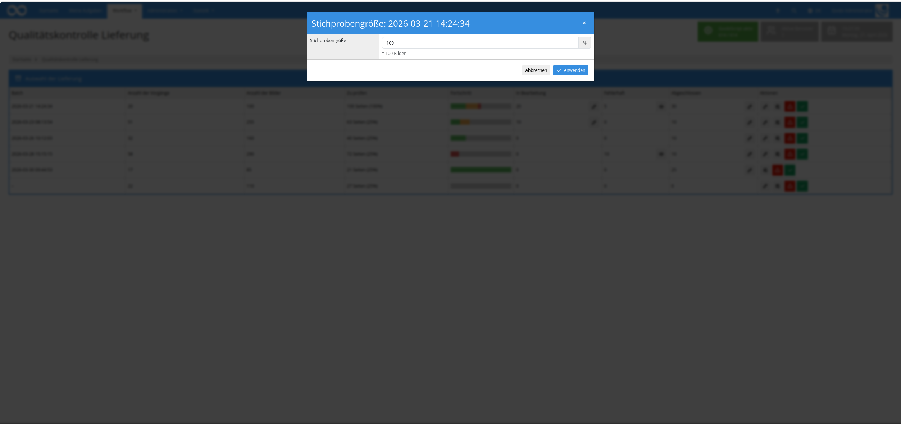

## Einführung
Dieses Workflow-Plugin ermöglicht eine prozentuale Qualitätskontrolle ganzer Lieferungen (Batches). Aus jedem Batch wird automatisch eine Stichprobe an Vorgängen gezogen, deren Digitalisate und Metadaten in einer einheitlichen Oberfläche gemeinsam geprüft werden. Die Bearbeitung erfolgt in mehreren Durchgängen, bis die konfigurierte Prüfschwelle erreicht ist. Jeder Vorgang muss dabei als in Ordnung oder fehlerhaft markiert werden. Die gesamte Lieferung kann anschließend gebündelt abgenommen oder abgelehnt werden. Bei Ablehnung werden alle Vorgänge des Batches in ein konfigurierbares Projekt verschoben und optional auf eine Produktionsvorlage umgestellt.


## Installation
Um das Plugin nutzen zu können, müssen folgende Dateien installiert werden:

```bash
/opt/digiverso/goobi/plugins/workflow/plugin-workflow-batch-imageqa-base.jar
/opt/digiverso/goobi/plugins/GUI/plugin-workflow-batch-imageqa-gui.jar
/opt/digiverso/goobi/config/plugin_intranda_workflow_batch_imageqa.xml
```

Für eine Nutzung dieses Plugins muss der Nutzer über die korrekten Rollenberechtigungen verfügen. Das Plugin unterscheidet fein zwischen Lese-, Bearbeitungs- und Administrations-Rechten, sodass Nutzergruppen gezielt auf einzelne Teilfunktionen eingeschränkt werden können.

| Berechtigung | Beschreibung |
|---|---|
| `Plugin_workflow_batch_imageqa` | Grundvoraussetzung. Ermöglicht den Zugriff auf das Plugin und die Übersicht aller Lieferungen sowie das Bearbeiten der neu gezogenen Stichprobe. |
| `Plugin_workflow_batch_imageqa_finish` | Erlaubt das Abnehmen einer geprüften Lieferung. |
| `Plugin_workflow_batch_imageqa_reject` | Erlaubt das Ablehnen einer Lieferung. Alle Vorgänge des Batches werden dann in das konfigurierte Projekt verschoben und optional auf die konfigurierte Produktionsvorlage umgestellt. |
| `Plugin_workflow_batch_imageqa_view_in_progress` | Erlaubt das lesende Öffnen der Vorgänge, die aktuell in einem Prüfdurchgang liegen. |
| `Plugin_workflow_batch_imageqa_edit_in_progress` | Erlaubt das erneute Bearbeiten der in Arbeit befindlichen Vorgänge. |
| `Plugin_workflow_batch_imageqa_view_error` | Erlaubt das lesende Öffnen bereits als fehlerhaft markierter Vorgänge. |
| `Plugin_workflow_batch_imageqa_edit_error` | Erlaubt das erneute Bearbeiten bereits als fehlerhaft markierter Vorgänge. |
| `Plugin_workflow_batch_imageqa_view_finish` | Erlaubt das lesende Öffnen bereits abgeschlossener Vorgänge (akzeptiert und fehlerhaft). |
| `Plugin_workflow_batch_imageqa_edit_finish` | Erlaubt die nachträgliche Bearbeitung bereits abgeschlossener Vorgänge. |
| `Plugin_workflow_batch_imageqa_admin_sample_size` | Erlaubt das Anpassen der Stichprobengröße (prozentualer Prüfumfang) pro Lieferung. |
| `Plugin_workflow_batch_imageqa_view_csv` | Erlaubt den Download eines CSV-Berichts über alle als fehlerhaft markierten Vorgänge einer Lieferung. |

Ohne die Grundrolle `Plugin_workflow_batch_imageqa` wird anstelle der Plugin-Oberfläche ein entsprechender Hinweis angezeigt.

<!-- SCREENSHOT 6 (screen6_de.png): Plugin-Seite mit rotem Hinweisbanner "Um diese Seite anzuzeigen, benötigen Sie die folgende Berechtigung: Plugin_workflow_batch_imageqa". -->


Um die Rollen einer Nutzergruppe zuzuweisen, öffnen Sie die Goobi-Verwaltungsoberfläche und navigieren Sie zu `Administration` > `Nutzergruppen`. Wählen Sie die gewünschte Nutzergruppe aus oder legen Sie eine neue an und fügen Sie die benötigten Rollen in das Rollenfeld der Gruppe ein.

<!-- SCREENSHOT 7 (screen7_de.png): Bearbeitungsmaske einer Nutzergruppe mit den Rollen "Plugin_workflow_batch_imageqa", "Plugin_workflow_batch_imageqa_finish", "Plugin_workflow_batch_imageqa_reject", "Plugin_workflow_batch_imageqa_view_in_progress", "Plugin_workflow_batch_imageqa_edit_in_progress", "Plugin_workflow_batch_imageqa_view_error", "Plugin_workflow_batch_imageqa_edit_error", "Plugin_workflow_batch_imageqa_view_finish", "Plugin_workflow_batch_imageqa_edit_finish", "Plugin_workflow_batch_imageqa_admin_sample_size" und "Plugin_workflow_batch_imageqa_view_csv" im linken Bereich "Zugewiesene Rechte". -->


## Überblick und Funktionsweise
Wenn das Plugin korrekt installiert und konfiguriert wurde, ist es innerhalb des Menüpunkts `Workflow` unter `Qualitätskontrolle Lieferung` zu finden.

### Übersicht der Lieferungen
Auf der Übersichtsseite werden alle Lieferungen aufgelistet, die aktuell auf eine Prüfung warten. Berücksichtigt werden alle Batches, bei denen sämtliche Vorgänge den konfigurierten Arbeitsschritt (`qaTaskName`, z. B. `Image QA`) erreicht haben und dort offen, in Arbeit oder im Fehlerzustand sind. Solange noch nicht alle Vorgänge eines Batches diesen Schritt erreicht haben, wird die Lieferung nicht angezeigt.

Für jede Lieferung zeigt die Tabelle die folgenden Informationen:

- **Batchname** – Bezeichnung der Lieferung
- **Anzahl der Vorgänge** – Gesamtzahl der im Batch enthaltenen Vorgänge
- **Anzahl der Bilder** – Gesamtzahl aller Bilder der Lieferung
- **Anzahl der zu prüfenden Bilder** – aus Prozentwert und Bildanzahl errechneter Schwellenwert
- **Fortschritt** – mehrfarbiger Balken: abgenommen (grün), in Bearbeitung (gelb), fehlerhaft (rot) und noch nicht bearbeitet (grau); beim Überfahren zeigt ein Popover die genauen Zahlen
- **Anzahl Bilder in Bearbeitung** – Vorgänge, die aktuell in einem Prüfdurchgang liegen; je nach Rolle mit Auge- (Leseansicht) oder Stift-Symbol (Bearbeiten)
- **Anzahl Bilder mit Fehler** – bereits als fehlerhaft markierte Vorgänge; ebenfalls mit Auge/Stift-Einsprung
- **Anzahl bereits bearbeiteter Bilder** – alle abgeschlossenen Vorgänge (akzeptiert und fehlerhaft zusammen); ebenfalls mit Einsprung
- **Auswahl** – Aktions-Buttons zum Bearbeiten der Lieferung, zum Setzen der Stichprobengröße, zum Ablehnen und zum Abnehmen. Die einzelnen Buttons werden nur eingeblendet, wenn die jeweilige Rolle vorhanden ist.

<!-- SCREENSHOT 1 (screen1_de.png): Übersichtsseite "Qualitätskontrolle Lieferung" mit der Tabelle aller wartenden Lieferungen. Spalten: Batchname, Anzahl der Vorgänge, Anzahl der Bilder, Anzahl der zu prüfenden Bilder, Fortschritt (mehrfarbiger Balken), Anzahl Bilder in Bearbeitung (mit Auge/Stift-Buttons), Anzahl Bilder mit Fehler (mit Auge/Stift-Buttons), Anzahl bereits bearbeiteter Bilder (mit Auge/Stift-Buttons) sowie Auswahl mit den Aktions-Buttons Bearbeiten (Stift), Stichprobengröße (Regler-Icon), Ablehnen (rotes Warndreieck) und Abnehmen (grüner Haken). -->


### Stichprobengröße festlegen
Über den Button `Stichprobengröße` in der Spalte `Auswahl` lässt sich für jede Lieferung ein individueller prozentualer Prüfumfang festlegen. Hierfür wird ein Dialog geöffnet, in dem der Wert in Prozent eingegeben werden kann; unterhalb des Eingabefelds wird direkt die resultierende Anzahl zu prüfender Bilder angezeigt. Der Wert wird dauerhaft am Batch gespeichert und beim nächsten Aufruf wieder verwendet. Diese Funktion steht nur Nutzern mit der Rolle `Plugin_workflow_batch_imageqa_admin_sample_size` zur Verfügung.

<!-- SCREENSHOT 8 (screen8_de.png): Dialog "Stichprobengröße: [Batch-Name]" (Modal, blauer Header). Unter dem Label "Prozentuale Stichprobe" befindet sich ein Eingabefeld mit % als Suffix; darunter der Hinweistext "= [n] Bilder". Im Footer die Buttons "Abbrechen" und "Übernehmen" (blau). -->


### Stichprobenauswahl und Bearbeitung
Beim Öffnen einer Lieferung über das Stift-Symbol wird anhand des für den Batch hinterlegten prozentualen Werts eine Stichprobe zufällig ausgewählter Vorgänge vollständig angezeigt. Es werden so viele Vorgänge dargestellt, bis die Anzahl der zu prüfenden Bilder erreicht bzw. überschritten wurde. Zwei Gruppen von Vorgängen werden dabei **immer** einbezogen, auch wenn die Schwelle schon erreicht wäre:

- alle Vorgänge des Batches, die zuvor bereits eine Fehlerschleife durchlaufen haben
- alle Vorgänge, bei denen eines der unter `metadataToCheck` konfigurierten Metadaten existiert und einen Inhalt aufweist

Welche Metadaten neben den Bildern angezeigt werden, wird über die Konfiguration festgelegt (siehe Abschnitt *Konfiguration*). Metadatengruppen werden mit all ihren Feldern als eigene Box ausgegeben. Im Kopfbereich der Bearbeitungsansicht werden zur Orientierung permanent die wichtigsten Kennzahlen der Lieferung eingeblendet (Anzahl akzeptierter, fehlerhafter, in Arbeit befindlicher und noch offener Bilder sowie die Gesamt-Prüfschwelle); ein Popover zeigt die Werte als beschriftete Liste.

Pro Vorgang stehen in der Kopfzeile mehrere Aktionen zur Verfügung:

- **Journal** – blendet das Prozessjournal als Dialog ein
- **Metadateneditor** – öffnet den regulären Metadateneditor für den Vorgang; nur sichtbar, wenn die Ansicht nicht im Nur-Lesen-Modus ist
- **Grüner Haken** – markiert den Vorgang als valide
- **Rotes X** – markiert den Vorgang als fehlerhaft und blendet das Feld für eine optionale Fehlerbeschreibung ein
- **Warn-Symbol** – Hinweis, dass an diesem Vorgang eines der unter `metadataToCheck` konfigurierten Metadaten vorliegt (Zwangs-Stichprobe)

Die Umrandung jedes Vorgangs zeigt den Validierungszustand an: noch nicht bewertet (neutral), valide (grün) oder fehlerhaft (rot).

<!-- SCREENSHOT 2 (screen2_de.png): Bearbeitungsansicht einer Lieferung. Im Header oben rechts eine Statistik-Leiste mit Icons für abgenommene, fehlerhafte, in Arbeit befindliche und offene Bilder sowie der Prüfschwelle. Darunter mehrere Vorgänge untereinander — je als eigener Abschnitt mit Titel, Metadatentabelle links, Bildvorschau rechts und einer Button-Leiste im Header (Journal, Metadateneditor, grüner Haken, rotes X). -->


### Fehler an Vorgängen erfassen
Wird ein Vorgang über das rote X-Symbol als fehlerhaft markiert, erscheint unterhalb der Metadaten ein Eingabefeld `Fehlerbeschreibung`, in dem die Beanstandung optional in Freitext hinterlegt werden kann.

<!-- SCREENSHOT 3 (screen3_de.png): Bearbeitungsansicht mit einem Vorgang, der als fehlerhaft markiert wurde. Der gesamte Block ist rot umrandet, rechts im Header ist das rote X-Symbol aktiv hervorgehoben. Unterhalb der Metadaten befindet sich das Eingabefeld "Fehlerbeschreibung" mit einem Freitexteingabefeld. -->


### Durchgang abschließen
Am Ende eines Durchgangs muss **jeder** dargestellte Vorgang als valide oder fehlerhaft markiert sein; der Button `Weiter` (bzw. `Abschließen`, wenn die Schwelle erreicht ist) wird andernfalls deaktiviert. Für ein schnelles Freigeben sämtlicher Vorgänge steht zusätzlich der Button `Alle als valide markieren` zur Verfügung.

- `Weiter` lädt den nächsten Block Vorgänge, sofern die Prüfschwelle noch nicht erreicht ist
- `Abschließen` schließt die Bearbeitung ab und kehrt zur Übersicht zurück
- `Abbrechen` beendet die Bearbeitung und gibt die aktuellen Vorgänge wieder frei, sodass sie in einem späteren Durchgang erneut ausgewählt werden können

In den Zusatzansichten, die über die Einsprünge der Übersicht geöffnet werden (in Arbeit / Fehler / bereits bearbeitet), steht stattdessen ein `Speichern`-Button zur Verfügung, mit dem Änderungen an den angezeigten Vorgängen übernommen werden. Der `Abbrechen`-Button verwirft in diesen Ansichten nicht die Statusinformationen, sondern kehrt lediglich zur Übersicht zurück. Nutzer, die eine solche Ansicht ohne Bearbeitungsrecht öffnen, sehen statt der Bearbeitungs-Buttons lediglich einen `Zurück`-Button.

### Lieferung ablehnen oder abnehmen
Aus der Übersicht heraus lässt sich eine Lieferung jederzeit über die entsprechenden Buttons abnehmen (grüner Haken) oder ablehnen (rotes Warndreieck). In beiden Fällen wird ein Dialog geöffnet, der eine Ergebnisübersicht der Lieferung anzeigt: Anzahl Vorgänge, Anzahl Bilder, Prüfschwelle sowie geprüfte, akzeptierte und fehlerhafte Bilder jeweils als Zahl und Prozentwert.

Beim Ablehnen einer Lieferung werden alle zugehörigen Vorgänge in das unter `inactiveProject` konfigurierte Projekt verschoben. Ist zusätzlich unter `inactiveProcessTemplate` eine Produktionsvorlage angegeben, werden die Vorgänge auf diese Vorlage umgestellt (z. B. eine Vorlage mit einer Sperrfrist und automatischer Löschung). Der erste darin enthaltene automatische Schritt wird direkt angestoßen. Außerdem lässt sich im selben Dialog ein CSV-Bericht mit allen Fehlermeldungen herunterladen (nur mit Rolle `Plugin_workflow_batch_imageqa_view_csv` sichtbar).

<!-- SCREENSHOT 4 (screen4_de.png): Ablehnen-Dialog (Modal) mit rotem Header "Ablehnen: [Batch-Name]". Im Modal-Body werden zwei Abschnitte gezeigt: "Übersicht" (Anzahl Vorgänge, Anzahl Bilder, Anzahl zu prüfender Bilder) und "Ergebnis" (geprüfte, akzeptierte, fehlerhafte Bilder jeweils als Zahl und Prozentwert). Im Footer die Buttons "Abbrechen", "CSV herunterladen" und "Ablehnen" (rot). -->


Wird eine Lieferung abgenommen, werden die QA-Schritte aller Vorgänge des Batches automatisch abgeschlossen und der reguläre Workflow läuft für jeden Vorgang weiter.

<!-- SCREENSHOT 5 (screen5_de.png): Abnehmen-Dialog (Modal) mit grünem Header "Abnehmen: [Batch-Name]". Im Modal-Body die gleiche zweiteilige Ergebnistabelle wie beim Ablehnen-Dialog. Im Footer die Buttons "Abbrechen" und "Abnehmen" (grün). -->


## Konfiguration
Die Konfiguration des Plugins erfolgt in der Datei `plugin_intranda_workflow_batch_imageqa.xml` wie hier aufgezeigt:

```xml
<config_plugin>

    <!-- step name -->
    <qaTaskName>Image QA</qaTaskName>


    <!-- percentage of images to display -->
    <percentage>25</percentage>
    <!-- number of processes per page -->
    <numberOfProcessesPerPage>2</numberOfProcessesPerPage>
    <!-- thumbnail size in pixel -->
    <thumbnailSize>200</thumbnailSize>
    <!-- Project to which error batches are moved -->
    <inactiveProject>Archive_Project</inactiveProject>
    <!-- change rejected batches to use this template -->
    <inactiveProcessTemplate>Deletion_Template</inactiveProcessTemplate>

    <!--display as box title -->
    <titleField>TitleDocMain</titleField>


    <!-- metadata list-->
    <metadata>CatalogIDDigital</metadata>
    <metadata>TitleDocMain</metadata>
    <metadata>shelfmarksource</metadata>
    <metadata>PlaceOfPublication</metadata>
    <metadata>PublicationYear</metadata>
    <metadata>PublisherName</metadata>
    <metadata>singleDigCollection</metadata>
    <!-- Person -->
    <metadata>Author</metadata>
    <!-- Group name -->
    <metadata>Group name</metadata>


    <!-- images are always displayed, if one of the configured metadata fields exists -->
    <metadataToCheck>DocLanguages</metadataToCheck>
    <metadataToCheck>PublicationYear</metadataToCheck>
</config_plugin>
```

Die folgende Tabelle enthält eine Zusammenstellung der Parameter und ihrer Beschreibungen:

Parameter                   | Erläuterung
----------------------------|-----------------------------------------------------------------------------------------------------------------------------------------------------------------------------------------------------------------------------------
`qaTaskName`                | Name des Arbeitsschritts, in dem sich Vorgänge eines Batches befinden müssen (offen, in Arbeit oder im Fehlerzustand), damit der Batch als Lieferung aufgeführt wird. Die Lieferung erscheint erst, wenn alle Vorgänge des Batches diesen Schritt erreicht haben.
`percentage`                | Standard-Prozentwert, der bestimmt, welcher Anteil der Bilder eines Batches stichprobenartig geprüft werden soll. Kann pro Lieferung über den Stichprobengrößen-Dialog angepasst und am Batch gespeichert werden.
`numberOfProcessesPerPage`  | Anzahl der Vorgänge, die innerhalb eines Prüfdurchgangs gleichzeitig angezeigt werden. Weitere Vorgänge werden in Folgedurchgängen nachgezogen, bis die Prüfschwelle erreicht ist.
`thumbnailSize`             | Größe der in der Oberfläche angezeigten Thumbnails in Pixel.
`inactiveProject`           | Name des Projekts, in das alle Vorgänge eines abgelehnten Batches verschoben werden. Der Name muss exakt mit dem Projektnamen in Goobi übereinstimmen.
`inactiveProcessTemplate`   | Optional: Name einer Produktionsvorlage, auf die abgelehnte Vorgänge umgestellt werden (z. B. eine Vorlage mit automatischer Löschung nach einer Sperrfrist). Der erste automatische Schritt der Vorlage wird nach dem Umstellen unmittelbar gestartet. Ist der Parameter nicht gesetzt oder leer, bleibt die bestehende Vorlage unverändert.
`titleField`                | Name des Metadatums, dessen Wert als Titel in der Kopfzeile jedes Vorgangs angezeigt wird. Ist das Feld leer oder nicht vorhanden, wird der Vorgangstitel verwendet.
`metadata`                  | Wiederholbares Feld. Die hier konfigurierten Metadaten werden in der angegebenen Reihenfolge neben dem Bild angezeigt. Zulässig sind einfache Metadaten, Personen und Namen von Metadatengruppen (letztere werden als eigene Box mit allen enthaltenen Feldern dargestellt).
`metadataToCheck`           | Wiederholbares Feld. Vorgänge, bei denen eines dieser Metadaten existiert und einen Inhalt aufweist, werden grundsätzlich in die Prüfung aufgenommen — auch dann, wenn die prozentuale Schwelle bereits erreicht wurde. Im Bearbeitungsmodus sind sie durch ein Warn-Symbol in der Kopfzeile des Vorgangs erkennbar.
