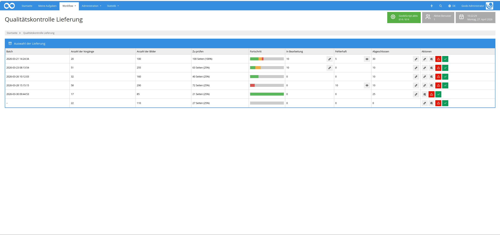
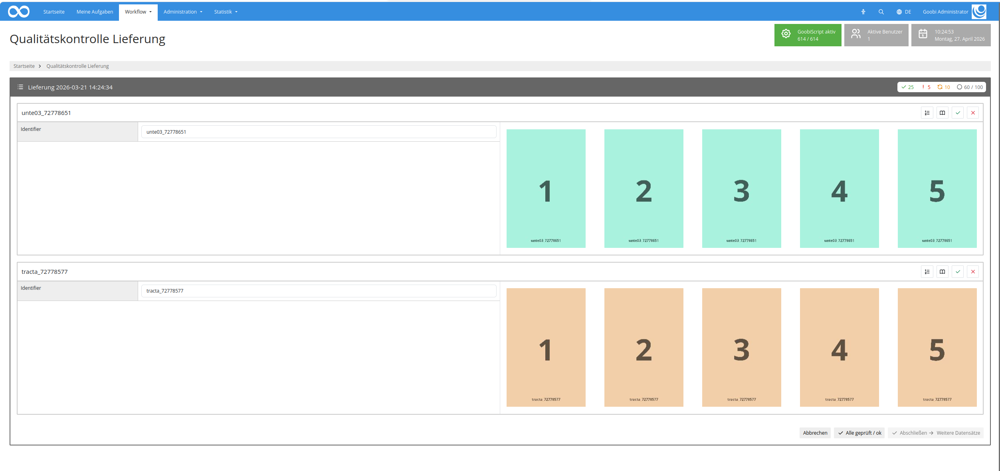
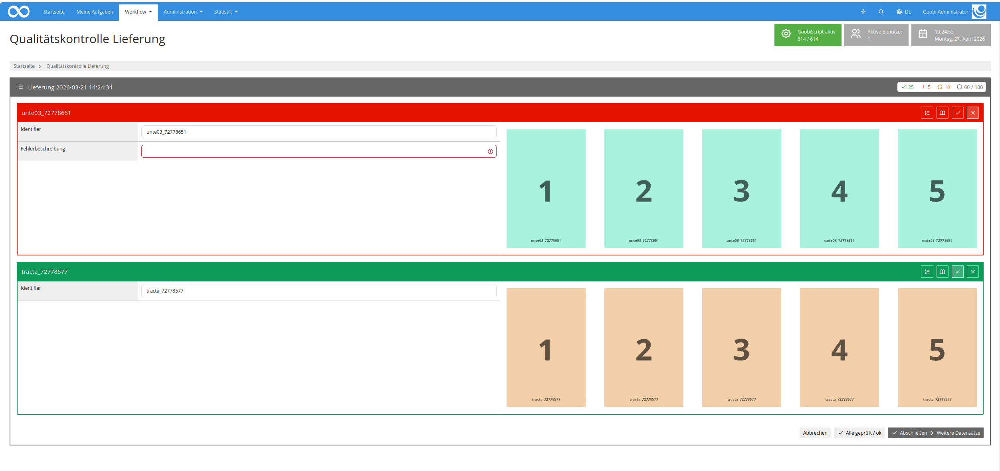

## Einführung
Dieses Workflow-Plugin erlaubt die Durchführung einer prozentualen Qualitätskontrolle von Lieferungen. Dabei können viele Vorgänge gleichzeitig bearbeitet werden.

## Installation
Um das Plugin nutzen zu können, müssen folgende Dateien installiert werden:

```bash
/opt/digiverso/goobi/plugins/workflow/plugin-workflow-batch-imageqa-base.jar
/opt/digiverso/goobi/plugins/GUI/plugin-workflow-batch-imageqa-gui.jar
/opt/digiverso/goobi/config/plugin_intranda_workflow_batch_imageqa.xml
```

Für eine Nutzung dieses Plugins muss der Nutzer über die korrekte Rollenberechtigung verfügen.



Bitte weisen Sie daher der Gruppe die Rolle `Plugin_workflow_batch_imageqa` zu.




## Überblick und Funktionsweise
Wenn das Plugin korrekt installiert und konfiguriert wurde, ist es innerhalb des Menüpunkts `Workflow` zu finden.



Auf der Übersichtsseite werden alle Lieferungen angezeigt, bei denen alle Vorgänge den konfigurierten Schritt zur Qualitätskontrolle erreicht haben. Wenn noch nicht alle Vorgänge soweit fortgeschritten sind, wird die Lieferung hier noch nicht angezeigt.

Öffnet man eine Lieferung, wird anhand der konfigurierten Prozentangabe ermittelt, wie viele und welche Bilder angezeigt werden sollen. Dabei werden so viele Vorgänge vollständig angezeigt, bis die Anzahl der erwarteten Bilder überschritten wurde. Auf die Auswahl der Vorgänge hat der Nutzer keinen Einfluss, es gibt jedoch zwei Ausnahmen: Vorgänge, die eine Fehlerschleife durchlaufen haben und Vorgänge, bei denen bestimmte, konfigurierbare Metadaten existieren, werden immer angezeigt, auch wenn damit die Anzahl der anzuzeigenden Bilder überschritten wird.
Der Titel und die Metadaten für jeden anzuzeigenden Vorgang lassen sich konfigurieren. 

Wenn ein Vorgang fehlerhaft ist, kann dafür eine Meldung verfasst werden. Außerdem ist es möglich, eine CSV Datei mit allen Fehlermeldungen zu generieren. 


Bei Fehlern kann die Lieferung abgelehnt werden. Fehlerhaft markierte Vorgänge werden dann zurück an den konfigurierten Schritt geschickt. Andernfalls wird bei allen Vorgängen der Lieferung der Schritt der Qualitätskontrolle abgeschlossen.

## Konfiguration
Die Konfiguration des Plugins erfolgt in der Datei `plugin_intranda_workflow_batch_imageqa.xml` wie hier aufgezeigt:

{{CONFIG_CONTENT}}

Die folgende Tabelle enthält eine Zusammenstellung der Parameter und ihrer Beschreibungen:

Parameter               | Erläuterung
------------------------|------------------------------------
`qaTaskName`            | Vorgänge müssen den konfigurierten Schritt erreichen, damit sie in der Auflistung angezeigt werden
`errorStepName`         | Dieser Schritt wird geöffnet, wenn Vorgänge als fehlerhaft markiert werden
`percentage`            | konfiguriert die Anzahl der angezeigten Bilder
`numberOfProcessesPerPage` | Anzahl der gleichzeitig angezeigten Vorgänge. Weitere Vorgänge können mittels Paginator erreicht werden
`thumbnailSize`         | Größe der Bilder in Pixel
`titleField`            | Metadatum, das für die Titelzeile genutzt wird
`metadata`              | Wiederholbares Feld. Hier konfigurierte Metadaten werden in der Reihenfolge der Konfiguration angezeigt
`metadataToCheck`       | Wiederholbares Feld. Wenn ein Vorgang ein hier konfigurierbares Metadatum enthält, wird er immer angezeigt, auch wenn die Anzahl der anzuzeigenden Bilder bereits überschritten wurde.

