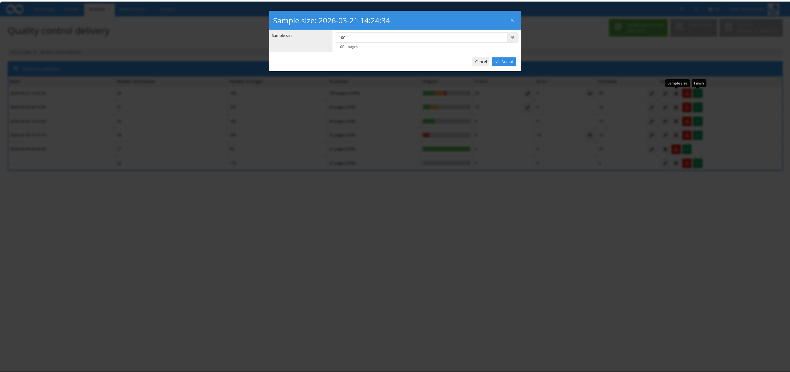

## Introduction
This workflow plugin enables a percentage-based quality control of entire deliveries (batches). For each batch a random sample of processes is selected automatically and their digitised images and metadata are reviewed together in a single interface. The review is performed in several passes until the configured inspection threshold is reached. Each process must be marked as valid or faulty. The delivery as a whole can then either be accepted or rejected. When a delivery is rejected, all processes of the batch are moved to a configurable project and optionally switched over to a production template.


## Installation
To use the plugin, the following files must be installed:

```bash
/opt/digiverso/goobi/plugins/workflow/plugin-workflow-batch-imageqa-base.jar
/opt/digiverso/goobi/plugins/GUI/plugin-workflow-batch-imageqa-gui.jar
/opt/digiverso/goobi/config/plugin_intranda_workflow_batch_imageqa.xml
```

In order to use this plugin, users must have the correct role permissions. The plugin distinguishes between read, edit and administration rights at a fine-grained level, so that user groups can be restricted to individual sub-functions.

| Permission | Description |
|---|---|
| `Plugin_workflow_batch_imageqa` | Base requirement. Grants access to the plugin, to the overview of all deliveries and to the review of the freshly drawn sample. |
| `Plugin_workflow_batch_imageqa_finish` | Allows an inspected delivery to be accepted. |
| `Plugin_workflow_batch_imageqa_reject` | Allows a delivery to be rejected. All processes of the batch are then moved to the configured project and optionally switched over to the configured production template. |
| `Plugin_workflow_batch_imageqa_view_in_progress` | Allows read-only access to processes that are currently part of an open inspection round. |
| `Plugin_workflow_batch_imageqa_edit_in_progress` | Allows processes that are currently in work to be reopened for editing. |
| `Plugin_workflow_batch_imageqa_view_error` | Allows read-only access to processes that have already been marked as faulty. |
| `Plugin_workflow_batch_imageqa_edit_error` | Allows processes that have already been marked as faulty to be re-edited. |
| `Plugin_workflow_batch_imageqa_view_finish` | Allows read-only access to processes whose review has already been completed (accepted and faulty). |
| `Plugin_workflow_batch_imageqa_edit_finish` | Allows the subsequent editing of processes whose review has already been completed. |
| `Plugin_workflow_batch_imageqa_admin_sample_size` | Allows the sample size (percentage-based inspection scope) to be adjusted per delivery. |
| `Plugin_workflow_batch_imageqa_view_csv` | Allows a CSV report containing all processes marked as faulty to be downloaded. |

Without the base role `Plugin_workflow_batch_imageqa`, an informational message is displayed instead of the plugin interface.

<!-- SCREENSHOT 6 (screen6_en.png): Plugin page with red information banner "To view this page you need the following permission: Plugin_workflow_batch_imageqa". -->


To assign the roles to a user group, open the Goobi administration interface and navigate to `Administration` > `User groups`. Select the desired user group or create a new one and add the required roles to the roles field of the group.

<!-- SCREENSHOT 7 (screen7_en.png): Edit mask of a user group with the roles "Plugin_workflow_batch_imageqa", "Plugin_workflow_batch_imageqa_finish", "Plugin_workflow_batch_imageqa_reject", "Plugin_workflow_batch_imageqa_view_in_progress", "Plugin_workflow_batch_imageqa_edit_in_progress", "Plugin_workflow_batch_imageqa_view_error", "Plugin_workflow_batch_imageqa_edit_error", "Plugin_workflow_batch_imageqa_view_finish", "Plugin_workflow_batch_imageqa_edit_finish", "Plugin_workflow_batch_imageqa_admin_sample_size" and "Plugin_workflow_batch_imageqa_view_csv" in the "Assigned rights" area on the left. -->


## Overview and functionality
Once the plugin has been correctly installed and configured, it can be found under the menu item `Workflow` as `Delivery quality control`.

### Overview of deliveries
The overview page lists all deliveries that are currently awaiting inspection. Only those batches are taken into account whose processes have all reached the configured workflow step (`qaTaskName`, e.g. `Image QA`) and in which the step is open, in work or in error state. As long as not all processes of a batch have reached this step, the delivery is not displayed.

For each delivery, the table displays the following information:

- **Batch name** – label of the delivery
- **Number of processes** – total number of processes contained in the batch
- **Number of images** – total number of images of the delivery
- **Number of images to inspect** – threshold calculated from percentage and image count
- **Progress** – multi-coloured bar: accepted (green), in work (yellow), faulty (red) and not yet processed (grey); a popover on hover displays the exact figures
- **Number of images in work** – processes that are currently part of an open inspection round; depending on the role with an eye icon (read-only) or a pencil icon (edit)
- **Number of images with error** – processes already marked as faulty; also with eye/pencil shortcut
- **Number of images already processed** – all completed processes (accepted and faulty combined); also with shortcut
- **Selection** – action buttons to edit the delivery, to set the sample size, to reject and to accept the delivery. The individual buttons are only displayed if the corresponding role is assigned.

<!-- SCREENSHOT 1 (screen1_en.png): Overview page "Delivery quality control" with the table of all pending deliveries. Columns: Batch name, Number of processes, Number of images, Number of images to inspect, Progress (multi-coloured bar), Number of images in work (with eye/pencil buttons), Number of images with error (with eye/pencil buttons), Number of images already processed (with eye/pencil buttons), and Selection with the action buttons Edit (pencil), Sample size (slider icon), Reject (red warning triangle) and Accept (green check mark). -->


### Setting the sample size
The `Sample size` button in the `Selection` column can be used to define an individual percentage inspection scope for each delivery. Clicking the button opens a dialog in which the value can be entered as a percentage; directly below the input field the resulting number of images to be inspected is shown. The value is stored permanently on the batch and used again the next time the delivery is opened. This function is only available to users holding the role `Plugin_workflow_batch_imageqa_admin_sample_size`.

<!-- SCREENSHOT 8 (screen8_en.png): Dialog "Sample size: [batch name]" (modal, blue header). Below the label "Percentage sample" there is an input field with % as suffix; underneath the hint text "= [n] images". In the footer the buttons "Cancel" and "Apply" (blue). -->


### Sample selection and review
When a delivery is opened via the pencil icon, a sample of randomly selected processes is displayed in full based on the percentage value stored for the batch. Processes are displayed until the number of images to inspect has been reached or exceeded. Two groups of processes are **always** included, even if the threshold has already been reached:

- all processes of the batch that have previously gone through an error loop
- all processes for which one of the metadata fields configured under `metadataToCheck` exists and contains a value

The metadata displayed alongside the images is defined via the configuration (see section *Configuration*). Metadata groups are rendered as a separate box containing all of their fields. At the top of the review screen, the most important figures of the delivery are always visible for orientation (number of accepted, faulty, in-work and still open images as well as the overall inspection threshold); a popover shows the values as a labelled list.

For each process, several actions are available in the header:

- **Journal** – displays the process journal in a dialog
- **Metadata editor** – opens the standard metadata editor for the process; only visible when the view is not in read-only mode
- **Green check mark** – marks the process as valid
- **Red X** – marks the process as faulty and reveals an optional error description field
- **Warning icon** – indicates that one of the metadata fields configured under `metadataToCheck` exists for this process (mandatory sample)

The border of each process indicates its validation state: not yet reviewed (neutral), valid (green) or faulty (red).

<!-- SCREENSHOT 2 (screen2_en.png): Review screen of a delivery. In the top-right header a statistics bar shows icons for accepted, faulty, in-work and open images as well as the inspection threshold. Below, several processes are listed one after the other — each as its own section with title, metadata table on the left, image preview on the right and a button bar in the header (Journal, Metadata editor, green check mark, red X). -->


### Recording errors on processes
When a process is marked as faulty via the red X icon, an input field `Error description` appears below the metadata, in which the issue can optionally be entered in free text.

<!-- SCREENSHOT 3 (screen3_en.png): Review screen with a process that has been marked as faulty. The entire block is outlined in red, the red X icon in the header is highlighted. Below the metadata there is the input field "Error description" with a free text input area. -->


### Completing a review pass
At the end of a review pass, **every** displayed process must be marked as valid or faulty; the button `Next` (or `Complete`, when the threshold has been reached) remains disabled otherwise. To quickly approve all processes, the button `Mark all as valid` is also available.

- `Next` loads the next batch of processes if the inspection threshold has not yet been reached
- `Complete` completes the review and returns to the overview
- `Cancel` ends the review and releases the current processes, so that they can be picked up again in a later round

In the additional views that are opened via the shortcuts from the overview (in work / error / already processed), a `Save` button is available instead, which can be used to apply changes to the displayed processes. In these views the `Cancel` button does not discard the stored status information — it merely returns to the overview. Users who open one of these views without edit permission see only a `Back` button instead of the edit controls.

### Rejecting or accepting a delivery
From the overview, a delivery can be accepted (green check mark) or rejected (red warning triangle) at any time via the corresponding buttons. In both cases a dialog is opened that displays a result overview of the delivery: number of processes, number of images, inspection threshold as well as inspected, accepted and faulty images, each shown as absolute value and percentage.

When a delivery is rejected, all of its processes are moved to the project configured under `inactiveProject`. If a production template is additionally set under `inactiveProcessTemplate`, the processes are switched over to that template (e.g. a template featuring a lock period and automatic deletion). The first automatic step it contains is triggered immediately. In the same dialog a CSV report containing all error messages can also be downloaded (only visible with the role `Plugin_workflow_batch_imageqa_view_csv`).

<!-- SCREENSHOT 4 (screen4_en.png): Reject dialog (modal) with red header "Reject: [batch name]". The modal body shows two sections: "Overview" (number of processes, number of images, number of images to inspect) and "Result" (inspected, accepted, faulty images, each as a number and percentage). In the footer the buttons "Cancel", "Download CSV" and "Reject" (red). -->


When a delivery is accepted, the QA steps of all processes of the batch are automatically closed and the regular workflow continues for each process.

<!-- SCREENSHOT 5 (screen5_en.png): Accept dialog (modal) with green header "Accept: [batch name]". The modal body displays the same two-part result table as in the reject dialog. In the footer the buttons "Cancel" and "Accept" (green). -->


## Configuration
The plugin is configured in the file `plugin_intranda_workflow_batch_imageqa.xml` as shown here:

```xml
<config_plugin>

    <!-- step name -->
    <qaTaskName>Image QA</qaTaskName>


    <!-- percentage of images to display -->
    <percentage>25</percentage>
    <!-- number of processes per page -->
    <numberOfProcessesPerPage>2</numberOfProcessesPerPage>
    <!-- thumbnail size in pixel -->
    <thumbnailSize>200</thumbnailSize>
    <!-- Project to which error batches are moved -->
    <inactiveProject>Archive_Project</inactiveProject>
    <!-- change rejected batches to use this template -->
    <inactiveProcessTemplate>Deletion_Template</inactiveProcessTemplate>

    <!--display as box title -->
    <titleField>TitleDocMain</titleField>


    <!-- metadata list-->
    <metadata>CatalogIDDigital</metadata>
    <metadata>TitleDocMain</metadata>
    <metadata>shelfmarksource</metadata>
    <metadata>PlaceOfPublication</metadata>
    <metadata>PublicationYear</metadata>
    <metadata>PublisherName</metadata>
    <metadata>singleDigCollection</metadata>
    <!-- Person -->
    <metadata>Author</metadata>
    <!-- Group name -->
    <metadata>Group name</metadata>


    <!-- images are always displayed, if one of the configured metadata fields exists -->
    <metadataToCheck>DocLanguages</metadataToCheck>
    <metadataToCheck>PublicationYear</metadataToCheck>
</config_plugin>
```

The following table provides an overview of the parameters and their descriptions:

Parameter                   | Description
----------------------------|-----------------------------------------------------------------------------------------------------------------------------------------------------------------------------------------------------------------------------------
`qaTaskName`                | Name of the workflow step in which the processes of a batch must be (open, in work or in error state) in order for the batch to be listed as a delivery. A delivery is only displayed once all processes of the batch have reached this step.
`percentage`                | Default percentage value that determines the share of a batch's images to be inspected as a sample. Can be adjusted per delivery via the sample size dialog and is then stored on the batch.
`numberOfProcessesPerPage`  | Number of processes displayed simultaneously within a single review pass. Further processes are pulled in during follow-up passes until the inspection threshold is reached.
`thumbnailSize`             | Size of the thumbnails displayed in the interface, in pixels.
`inactiveProject`           | Name of the project into which all processes of a rejected batch are moved. The name must match the project name in Goobi exactly.
`inactiveProcessTemplate`   | Optional: name of a production template to which rejected processes are switched (e.g. a template with automatic deletion after a lock period). After switching the template, the first automatic step it contains is triggered immediately. If this parameter is not set or left empty, the existing template remains unchanged.
`titleField`                | Name of the metadata field whose value is displayed as the title in the header of each process. If the field is empty or missing, the process title is used instead.
`metadata`                  | Repeatable field. The metadata configured here is displayed in the given order next to the image. Simple metadata, persons and names of metadata groups are allowed (groups are rendered as a separate box containing all of their fields).
`metadataToCheck`           | Repeatable field. Processes for which one of these metadata fields exists and contains a value are always included in the review — even if the percentage threshold has already been reached. In review mode these processes can be recognised by a warning icon in the process header.
