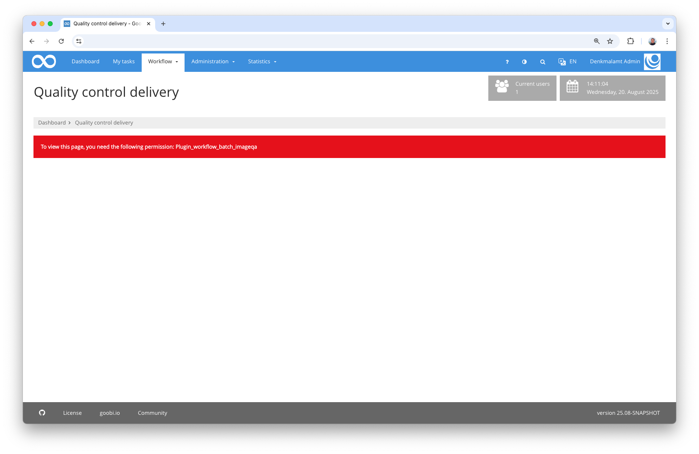
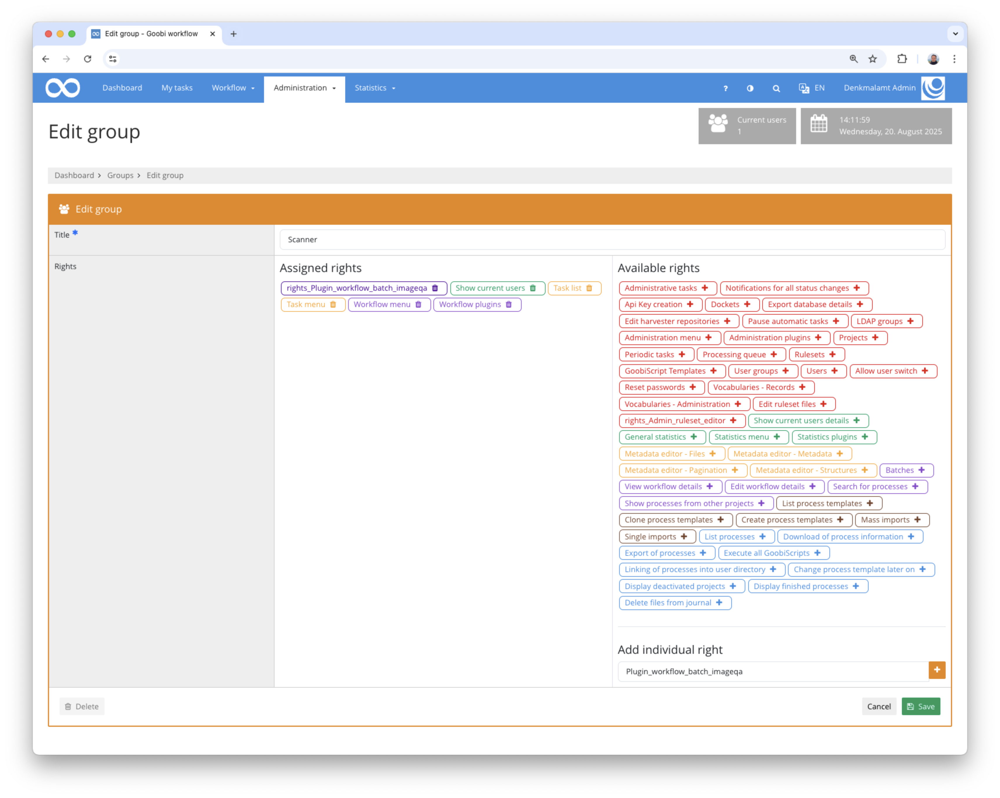
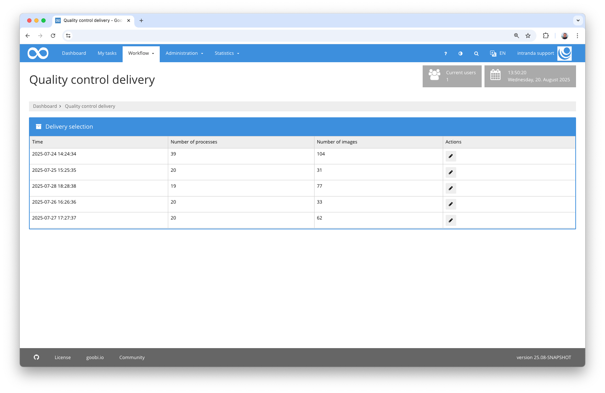
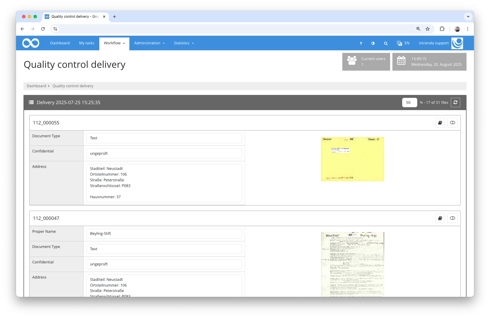
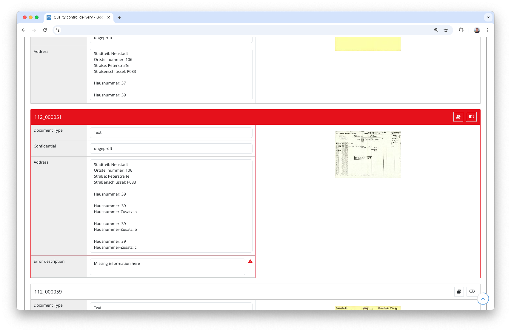
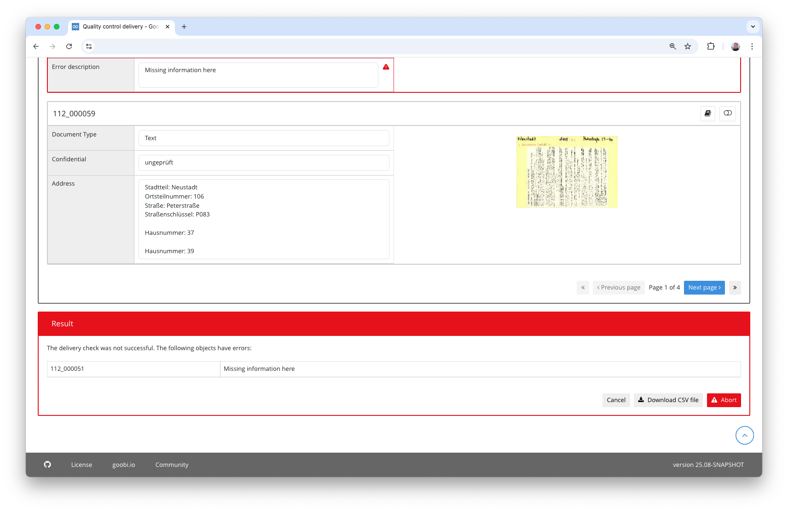
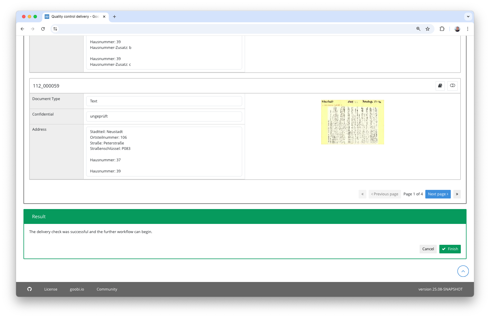

## Introduction
This workflow plugin allows you to perform a percentage-based quality control check on deliveries. It enables you to review the digitised documents and metadata of many processes simultaneously.

## Installation
To use the plugin, the following files must be installed:

```bash
/opt/digiverso/goobi/plugins/workflow/plugin-workflow-batch-imageqa-base.jar
/opt/digiverso/goobi/plugins/GUI/plugin-workflow-batch-imageqa-gui.jar
/opt/digiverso/goobi/config/plugin_intranda_workflow_batch_imageqa.xml
```

To use this plugin, the user must have the correct role permissions.



Please assign the role `Plugin_workflow_batch_imageqa` to the group.




## Overview and functionality
Once the plugin has been correctly installed and configured, it can be found under the menu item `Workflow`.



The overview page displays all deliveries (e.g. from a scanning service provider) that are awaiting acceptance. To do this, all processes in all batches for which the configured work step (e.g. "quality control") is currently open are checked. If not all processes in a batch have exactly this status, the batch is not yet displayed as a delivery here.

If you open such a batch as a delivery, the configured percentage is used to determine how many and which images are to be displayed. As many processes are displayed in full until the expected number of images is reached or exceeded.



The user has no influence on the selection of processes. This is done randomly. However, there are two exceptions to processes that are definitely listed within the processes to be displayed:

- All processes of a batch that have previously gone through an error loop 
- All processes of a batch for which certain, configurable metadata exists and which contain content 

The metadata displayed alongside the images can be defined for each process to be displayed within the configuration. The percentage value can also be reset in the upper right area of the plugin. In addition, the metadata editor can be accessed for each process displayed in order to make changes to the data there.

If a process is faulty, an error message can be written for it.



All error messages are listed in the lower section of the plugin and allow you to reject such a delivery. In addition, it is also possible to download a CSV file containing all error messages.



In the event of errors, the delivery can be rejected. In this case, processes marked as faulty are returned to the configured workflow step. 

If a delivery is approved, it can be accepted. All processes related to the delivery will then complete the current workflow step and continue to progress through the workflow.




## Configuration
The plugin is configured in the file `plugin_intranda_workflow_batch_imageqa.xml` as shown here:

{{CONFIG_CONTENT}}

The following table contains a summary of the parameters and their descriptions:

Parameter                  | explanation
---------------------------|--------------------------------------------------------------------------------------------------------------------------------------------------------------------------------------
`qaTaskName`               | All processes in a batch must be in this work step (open) in order to be included in the list.
`errorStepName`            | This step is opened when processes are marked as faulty.
`percentage`               | This value specifies the percentage value for the images to be displayed.
`numberOfProcessesPerPage` | Number of processes to be displayed simultaneously. Additional processes can be accessed using the paginator.
`thumbnailSize`            | Size of images in pixels
`titleField`               | Metadata to be used for the title line.
`metadata`                 | Repeatable field. Metadata configured here is displayed in the order of configuration. It is also possible to use the names of metadata groups here. These are then listed as boxes.
`metadataToCheck`          | Repeatable field. If an operation contains metadata that can be configured here, it will always be displayed, even if the number of images to be displayed has already been exceeded.

